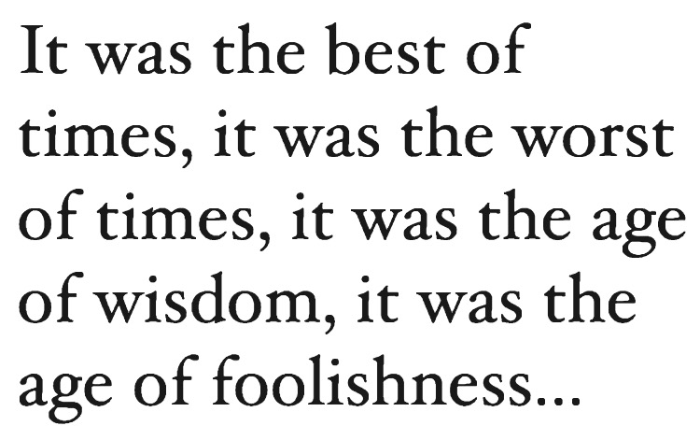

# 📄 OCR Pipeline (Optical Character Recognition)

This repository contains the implementation of **NTI Task 7 Sub Task 1** by **Mohamed Ehab Yousri**.  
It provides a **complete OCR (Optical Character Recognition) pipeline** that extracts text from images, applies preprocessing, performs text detection and recognition using **Tesseract OCR** and **EasyOCR**, applies **spell correction**, and exports the processed text into multiple file formats (**TXT, DOCX, PDF**).  

The project is designed for academic purposes, demonstrating a robust workflow for **document digitization**, **text cleaning**, and **multi-format export**.

---

## 📑 Table of Contents

- [Introduction](#-introduction)
- [Features](#-features)
- [Installation](#-installation)
- [Usage](#-usage)
  - [1. Image Acquisition](#1-image-acquisition)
  - [2. Preprocessing](#2-preprocessing)
  - [3. OCR & Text Recognition](#3-ocr--text-recognition)
  - [4. Text Cleaning & Spell Correction](#4-text-cleaning--spell-correction)
  - [5. Export Outputs](#5-export-outputs)
  - [6. Alternative OCR with EasyOCR](#6-alternative-ocr-with-easyocr)
- [Example](#-example)
- [Dependencies](#-dependencies)
- [Limitations](#-limitations)
- [Future Work](#-future-work)
---

## 🔍 Introduction

Optical Character Recognition (**OCR**) is the process of converting printed or handwritten text images into machine-readable text.  
This project demonstrates a full pipeline that:

1. Reads an input image (e.g., scanned document).  
2. Preprocesses the image (grayscale, noise removal, binarization, deskew).  
3. Extracts text using **Tesseract OCR** and optionally **EasyOCR**.  
4. Cleans and corrects the extracted text using **Regex + SpellChecker**.  
5. Exports the text in **TXT, DOCX, and searchable PDF formats**.

---

## ✨ Features

- 🖼️ **Image Preprocessing**: Grayscale, thresholding, noise reduction, deskew.  
- 🔠 **OCR with Tesseract**: High-quality text recognition.  
- 🧠 **Alternative OCR**: EasyOCR for comparison.  
- 📝 **Text Cleaning**: Remove unwanted characters and normalize spaces.  
- ✅ **Spell Correction**: Automatic word correction with `pyspellchecker`.  
- 📤 **Export**: Save outputs in TXT, DOCX, PDF.  
- 📊 **Visualization**: Show intermediate preprocessing steps.  

---


## ⚙️ Installation

Clone this repository:

```bash
git clone https://github.com/<your-username>/NTI_Task_7_Sub_task_1__Mohamed_Ehab_Yousri.git
cd NTI_Task_7_Sub_task_1__Mohamed_Ehab_Yousri
```
## Install dependencies:

bash
Copy code
# Install Tesseract OCR
sudo apt install tesseract-ocr

# Install Python libraries

## 📊 Example

| Step                    | Output (Preview)                          |
| ----------------------- | ----------------------------------------- |
| Input Image             |                    |
| Preprocessed (Deskewed) | *(binary deskewed image preview)*         |
| Raw OCR Text            | `"Ths is smple txt wth errrs"`            |
| Cleaned & Corrected     | `"This is simple text with errors"`       |
| Exported Files          | `output.txt`, `output.docx`, `output.pdf` |

## 📦 Dependencies

Tesseract OCR

pytesseract

OpenCV

Pillow (PIL)

python-docx

pyspellchecker

matplotlib

EasyOCR

BeautifulSoup4

pandas

## ⚠️ Limitations

Spell correction may over-correct domain-specific terms.

OCR accuracy depends heavily on image quality (blurry/low-res images reduce performance).

Tesseract supports multiple languages, but only English is demonstrated here.

PDF export uses Tesseract’s built-in functionality; layout preservation is limited.

## 🔮 Future Work

Add Arabic OCR using ara.traineddata.

Integrate deep learning OCR models (e.g., TrOCR, Donut).

Support multi-page documents.

Add a Dockerfile for easy deployment.

Build a Flask/Django web interface for uploading images and downloading results.
pip install pytesseract opencv-python pillow python-docx pyspellchecker matplotlib easyocr requests beautifulsoup4 pandas
